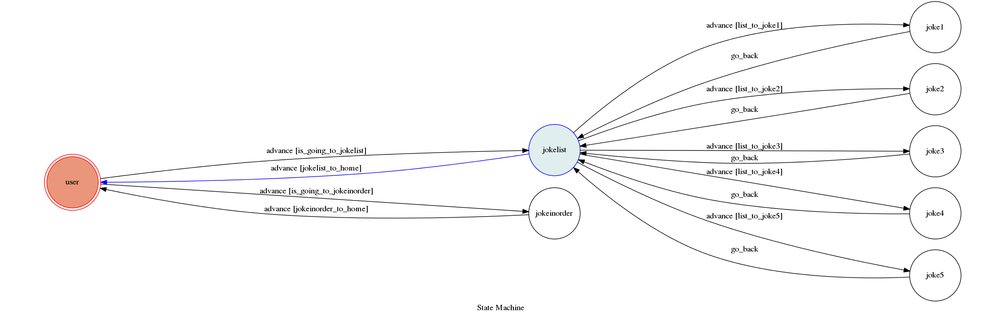

# TOC Project 2017

Template Code for TOC Project 2017

A telegram bot based on a finite state machine

## Run the sever

```sh
python3 app.py
```

## Finite State Machine


## Usage
The initial state is set to `user`.

User can input `list` to list all of the jokes and able to select which joke to listening to, or input `joke` to listen all jokes.
If the user input `list`, the program will list all of the jokes, and user can select the joke by entering `joke(number)`.
e.g. joke1 , joke2 ...

After the state is set to `jokelist` or `jokeinorder`, the user has to enter `home` to restart the program.(then able to input `list` or `joke` again)

## Author
[Bobby-Lai](https://github.com/Bobby-Lai)
